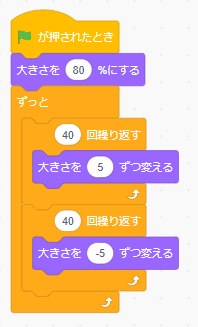
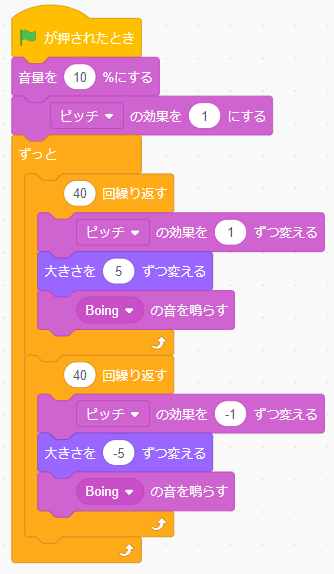

# likeScratch3 

Supporting for using Scratch3 libraries

## Version

0.0.1  ( 作成中 )

# サンプル

## sample01

ステージの背景画像を読み込み表示します。

### WEB Page
https://amami-harhid.github.io/scratch3LikeJsTrial/web/sample01/

## sample02

スプライトの画像(PNG)を読み込み表示します。

サイズを大きくしたり小さくしたりします。

これと同じ効果です。

### WEB Page

https://amami-harhid.github.io/scratch3LikeJsTrial/web/sample02/

## sample03

スプライトの画像(SVG)を読み込み表示します。

これと同じ動きをします。

### WEB Page

https://amami-harhid.github.io/scratch3LikeJsTrial/web/sample03/
